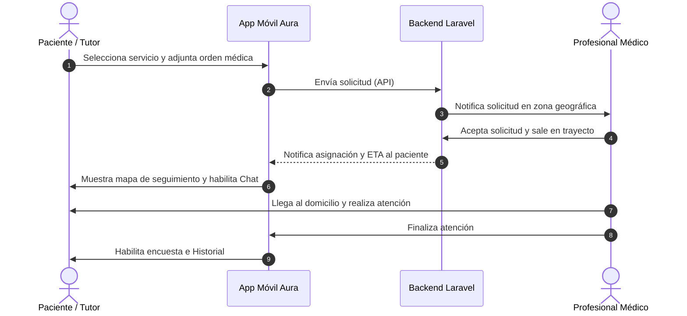

# Manual del Usuario Completo — Aura Salud

¡Bienvenido a **Aura Salud**! Esta es la guía de usuario definitiva para comprender, configurar y operar la aplicación móvil de atención de salud a domicilio.

**Aura Salud** es una aplicación móvil multiplataforma desarrollada en Flutter que conecta de manera directa a los pacientes y sus cargas familiares con profesionales de la salud capacitados para realizar consultas, tratamientos, exámenes e inyecciones en la comodidad del hogar.

---

## 📌 Tabla de Contenidos
1. [Introducción y Propósito](#-introducción-y-propósito)
2. [Perfiles y Roles en la Plataforma](#-perfiles-y-roles-en-la-plataforma)
3. [Catálogo de Servicios Clínicos](#-catálogo-de-servicios-clínicos)
4. [Guía de Uso de la Aplicación Paso a Paso](#-guía-de-uso-de-la-aplicación-paso-a-paso)
   - [A. Onboarding y Registro](#a-onboarding-y-registro)
   - [B. Configuración del Perfil (Pacientes, Direcciones y Pagos)](#b-configuración-del-perfil-pacientes-direcciones-y-pagos)
   - [C. Solicitud de un Servicio Clínico](#c-solicitud-de-un-servicio-clínico)
   - [D. Monitoreo y Seguimiento en Tiempo Real](#d-monitoreo-y-seguimiento-en-tiempo-real)
   - [E. Chat con el Especialista Clínico](#e-chat-con-el-especialista-clínico)
   - [F. Historial y Repetición de Servicios](#f-historial-y-repetición-de-servicios)
5. [Mecanismos Técnicos Avanzados](#-mecanismos-técnicos-avanzados)
6. [Respuesta ante Emergencias Vitales](#-respuesta-ante-emergencias-vitales)

---

## 🏥 Introducción y Propósito

El sistema de **Aura Salud** está diseñado con un enfoque "móvil primero" y una interfaz moderna basada en **Material 3 (Teal #0D9488)**. Su objetivo principal es facilitar el acceso a la salud, ahorrando traslados y esperas innecesarias en clínicas u hospitales.

---

## 👥 Perfiles y Roles en la Plataforma

Para probar y simular la interacción completa, la aplicación implementa los siguientes roles dentro de su lógica:

1. **Paciente Principal (Usuario Titular):** Persona natural que registra la cuenta, administra el método de pago predeterminado y las direcciones del hogar. Puede solicitar servicios clínicos para sí mismo.
2. **Tutor o Apoderado:** El mismo usuario titular cuando solicita atenciones para sus familiares registrados (ej: sus hijos o padres de la tercera edad).
3. **Profesional Clínico (Prestador):** Médicos, enfermeros, kinesiólogos, radiólogos y técnicos de laboratorio autorizados que viajan al domicilio. Pueden conversar por chat interno con el paciente para coordinar detalles prácticos.
4. **Conductor de Ambulancia:** Personal encargado de los traslados programados que actualiza la ruta y el estado de la ambulancia.
5. **Operador / Administrador:** Monitorea la correcta asignación del personal, valida que las órdenes médicas adjuntas sean legibles y válidas antes de despachar al profesional.

---

## 📋 Catálogo de Servicios Clínicos

La aplicación cuenta con una cartera diversa de especialidades clínicas. Dependiendo de las normativas de salud locales, algunos servicios requieren estrictamente subir una **orden o receta médica digitalizada** para poder ser confirmados:

| Icono | Servicio | Descripción | Requiere Orden Médica | Precio Base | ETA Estimada (Min) |
| :---: | :--- | :--- | :---: | :---: | :---: |
| 💉 | **Enfermería** | Inyecciones, sueros, curaciones de heridas operatorias o complejas, colocación de sondas. | **Sí** | $15.000 | 30 - 50 |
| 🩺 | **Consulta Médica** | Evaluación general en casa de síntomas agudos comunes (fiebre, gripe, dolor estomacal). | No | $40.000 | 45 - 60 |
| 🚶‍♂️ | **Kinesiología Motora** | Sesiones de rehabilitación física para fracturas, esguinces o apoyo a adultos mayores. | **Sí** | $22.000 | 60 - 90 |
| 🫁 | **Kine Respiratoria** | Terapia de drenaje bronquial para pacientes pediátricos y adultos mayores. | **Sí** | $24.000 | 45 - 75 |
| 🤝 | **Cuidados Domiciliarios** | Asistencia en la higiene, alimentación y acompañamiento clínico menor (Mínimo 3 horas). | No | $12.000 | 120 - 180 |
| 🚑 | **Ambulancia** | Traslados programados de pacientes en camilla o silla de ruedas. *(Básico o Medicalizado)* | No | $18.500 | 15 - 30 |
| 🩻 | **Radiología** | Toma de placas de rayos X en casa con un equipo digital portátil. | **Sí** | $35.000 | 90 - 120 |
| 🧪 | **Toma de Muestras** | Extracción de sangre para exámenes de laboratorio clínicos habituales. | **Sí** | $19.500 | 60 - 90 |
| ❤️ | **Electrocardiograma** | Toma de ECG de 12 derivaciones con informe firmado por cardiólogo. | **Sí** | $21.000 | 45 - 60 |

---

## 📱 Guía de Uso de la Aplicación Paso a Paso

### A. Onboarding y Registro
1. **Pantallas de Introducción:** Al abrir la aplicación por primera vez, se te presentarán pantallas informativas detallando el alcance de Aura Salud. Presiona **Comenzar**.
2. **Método de Autenticación:** 
   * Puedes registrarte e iniciar sesión rápidamente utilizando tus redes sociales (**Google o Facebook**).
   * También puedes crear una cuenta clásica mediante tu **correo electrónico** y una contraseña.
   * **Modo Demo (Pruebas):** Si solo deseas conocer la navegación de la aplicación sin ingresar datos reales, presiona el botón **Ingresar en Modo Demo**. El sistema cargará información simulada al instante.

---

### B. Configuración del Perfil (Pacientes, Direcciones y Pagos)
Antes de pedir tu primer servicio, te recomendamos ingresar a la pestaña **Perfil** en la barra de navegación inferior para configurar tus datos base:

#### 1. Registrar Dependientes (Cargas Familiares)
1. Toca en el botón **Agregar Dependiente / Familiar**.
2. Ingresa el nombre completo, edad, parentesco (Hijo, Padre/Madre, Cónyuge), previsión de salud (Fonasa/Isapre) y detalla si tiene alergias o condiciones crónicas de importancia.
3. Haz clic en **Guardar**. Esta información estará disponible de inmediato en los formularios de solicitud.

#### 2. Configurar Direcciones Guardadas
1. Presiona **Agregar Dirección**.
2. Escribe una etiqueta que recuerdes fácilmente (ej: "Mi Casa", "Trabajo", "Casa Abuelos").
3. Escribe la dirección completa o utiliza el mapa interactivo para clavar el pin de geolocalización.
4. Presiona **Guardar**.

#### 3. Añadir Métodos de Pago
1. Toca en **Agregar Tarjeta**.
2. Digita los datos requeridos o vincula tu billetera digital Mercado Pago para compras integradas directas en un toque.

---

### C. Solicitud de un Servicio Clínico
1. En la pestaña de inicio (**Home**), explora el catálogo de especialidades. Si buscas algo específico, utiliza la barra de búsqueda superior o los filtros (ej: "Requiere Orden Médica" / "Sin Orden Médica").
2. Haz clic en el servicio deseado para abrir la ficha de solicitud.
3. **Rellena los campos esenciales:**
   * **¿Para quién es el servicio?:** Selecciona si es para ti (*Paciente Titular*) o elige un familiar de tu lista de *Dependientes*.
   * **Dirección de Atención:** Elige una dirección de tu lista o escribe una nueva. *(Si solicitas una Ambulancia, deberás indicar tanto la Dirección de Origen como la Dirección de Destino).*
   * **Síntomas o Indicaciones:** Escribe brevemente el cuadro clínico o el motivo de la consulta.
   * **Cargar Orden Médica (Si aplica):** 
     * Puedes usar la cámara del celular para tomar una fotografía de la receta/orden médica en papel.
     * O seleccionar un archivo PDF/Imagen desde la galería de tu dispositivo.
4. **Verificación de Tarifas y Tiempos:** El sistema calculará el total (en base a la tarifa estándar o tipo de ambulancia requerida) y te mostrará el tiempo de llegada estimado (ETA).
5. Presiona **Confirmar Solicitud**.

---

### D. Monitoreo y Seguimiento en Tiempo Real
Una vez enviado el pedido, la pantalla cambiará automáticamente a la pestaña de **Seguimiento Activo**:

1. **Estado de la Solicitud:** El progreso se visualizará paso a paso:
   * **Solicitado:** Buscando y asignando al especialista clínico disponible más cercano.
   * **Confirmado:** El profesional ha aceptado tu caso y se encuentra preparando su maletín clínico. Verás su nombre completo, fotografía, número de registro en el colegio médico y número telefónico de contacto.
   * **En Camino:** Visualiza la ubicación aproximada del profesional clínico en tiempo real en el mapa, junto con un cronómetro de cuenta regresiva con los minutos estimados de llegada.
   * **En Atención:** El profesional ha llegado a tu domicilio. La aplicación bloquea nuevos pedidos para esta cuenta hasta terminar el procedimiento.
   * **Completado:** El servicio ha terminado exitosamente.
2. **Simulador de Progreso:** Si estás utilizando la aplicación en modo de pruebas, verás en la parte superior derecha el botón **Avanzar Simulación** para forzar el cambio de estados y experimentar el ciclo de vida completo.

---

### E. Chat con el Especialista Clínico
1. Mientras la solicitud esté en los estados *Confirmado, En Camino o En Atención*, se habilitará un botón de **Mensajería (Chat)** en la pantalla de tracking.
2. Podrás chatear de manera directa y confidencial con el profesional clínico asignado.
3. Es ideal para dar indicaciones adicionales (ej: *"El timbre no funciona, favor golpear la puerta"* o *"Hay estacionamiento disponible dentro del condominio"*).

---

### F. Historial y Repetición de Servicios
1. Dirígete a la pestaña **Historial** en la barra inferior.
2. Aquí verás todas las atenciones médicas completadas en el pasado.
3. Al tocar cualquier registro anterior, podrás ver el resumen completo de la atención, recetas generadas y los informes de laboratorio o radiología digitalizados.
4. **Botón Repetir Servicio:** Si necesitas volver a agendar la misma atención (ej: una nueva sesión de Kinesiología), presiona el botón **Repetir Servicio**. La app rellenará los campos del formulario con los mismos datos del historial para agilizar tu solicitud.

---

## 🔒 Mecanismos Técnicos Avanzados

Aura Salud integra tecnologías pensadas para proteger la continuidad de la atención médica y tu privacidad:

1. **Modo Sin Conexión (Offline Support):** Si estás editando direcciones o agregando dependientes y tu señal celular falla, la aplicación guarda temporalmente los cambios en su base de datos local SQLite. Una cola de salida en segundo plano (*Outbox*) se encargará de sincronizar los cambios con los servidores de manera automática tan pronto como se recupere la conexión a internet.
2. **Seguridad y Encriptación:** Toda la comunicación entre la aplicación móvil y los servidores centrales viaja encriptada mediante protocolos seguros HTTPS. Los tokens de autenticación de usuario se guardan localmente bajo medidas de seguridad avanzada (*Secure Storage*).
3. **Notificaciones Push Activas (FCM):** El sistema te alertará en tiempo real sobre cambios de estado en tu pedido o nuevos mensajes en el chat, incluso si tienes la aplicación cerrada.

---

## 🚨 Respuesta ante Emergencias Vitales

> [!WARNING]
> **Aura Salud NO es un servicio de urgencia médica de riesgo vital.**
>
> Si el paciente presenta síntomas graves o potencialmente mortales como:
> * Dolor de pecho opresivo o sospecha de infarto cardíaco.
> * Dificultad severa para respirar (asfixia).
> * Pérdida súbita del conocimiento.
> * Sangrado profuso no controlado.
> * Pérdida de fuerza o parálisis facial repentina (sospecha de ataque cerebrovascular).
>
> **Por favor, NO intente solicitar un servicio por esta aplicación.** Llame de inmediato al número de emergencias públicas de su país (ej: **131 (SAMU)** en Chile, o **107** en Argentina) o traslade de urgencia al paciente al centro hospitalario más cercano.
