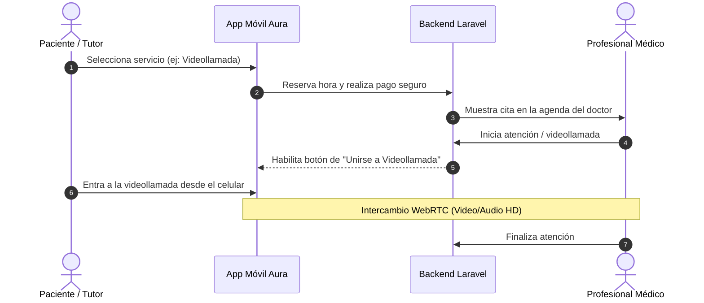

# Manual del Usuario Completo — Aura Salud

¡Bienvenido a **Aura Salud**! Esta es la guía de usuario definitiva para comprender, configurar y operar la aplicación móvil y el panel médico de atención de salud.

**Aura Salud** es un ecosistema de salud digital compuesto por una aplicación móvil multiplataforma desarrollada en Flutter (para pacientes) y un portal web administrativo/médico desarrollado en Laravel (para profesionales). Permite conectar a pacientes con especialistas para atenciones a domicilio o de manera remota mediante videollamadas integradas de alta definición.

---

## 📌 Tabla de Contenidos
1. [Introducción y Propósito](#-introducción-y-propósito)
2. [Perfiles y Roles en la Plataforma](#-perfiles-y-roles-en-la-plataforma)
3. [Catálogo de Servicios Clínicos y Telemedicina](#-catálogo-de-servicios-clínicos-y-telemedicina)
4. [Guía de Uso de la Aplicación Paso a Paso](#-guía-de-uso-de-la-aplicación-paso-a-paso)
   - [A. Onboarding y Registro](#a-onboarding-y-registro)
   - [B. Configuración del Perfil (Pacientes, Direcciones y Pagos)](#b-configuración-del-perfil-pacientes-direcciones-y-pagos)
   - [C. Solicitud de un Servicio Clínico](#c-solicitud-de-un-servicio-clínico)
   - [D. Monitoreo y Seguimiento en Tiempo Real](#d-monitoreo-y-seguimiento-en-tiempo-real)
   - [E. Chat con el Especialista Clínico](#e-chat-con-el-especialista-clínico)
   - [F. Atención Remota (Videollamada WebRTC)](#f-atención-remota-videollamada-webrtc)
   - [G. Historial y Repetición de Servicios](#g-historial-y-repetición-de-servicios)
5. [Mecanismos Técnicos Avanzados](#-mecanismos-técnicos-avanzados)
6. [Respuesta ante Emergencias Vitales](#-respuesta-ante-emergencias-vitales)
7. [Guía de Instalación y Despliegue (Entorno Técnico)](#-guía-de-instalación-y-despliegue-entorno-técnico)
   - [A. Arquitectura del Sistema](#a-arquitectura-del-sistema)
   - [B. Backend (API Laravel)](#b-backend-api-laravel)
   - [C. Aplicación Móvil (Flutter)](#c-aplicación-móvil-flutter)
   - [D. Configuración de Pruebas Globales (HTTPS, DDNS No-IP y SSL Bypass)](#d-configuración-de-pruebas-globales-https-ddns-no-ip-y-ssl-bypass)

---

## 🏥 Introducción y Propósito

El sistema de **Aura Salud** está diseñado con un enfoque moderno y fluido, implementando la guía de diseño **Material 3 (Teal #0D9488)** en la app móvil y un portal web de administración médica con diseño **Glassmorphism Oscuro** adaptable a múltiples resoluciones. 

Su propósito principal es simplificar el agendamiento médico, permitiendo telemedicina o atención presencial a domicilio en pocos minutos.



---

## 👥 Perfiles y Roles en la Plataforma

El ecosistema integra diferentes roles para simular el ciclo de vida completo de la atención médica:

1. **Paciente Principal (Usuario Titular):** Administra la cuenta, métodos de pago, direcciones y cargas familiares. Solicita servicios y realiza videollamadas desde el celular.
2. **Tutor o Apoderado:** El usuario titular cuando gestiona o solicita citas para sus familiares registrados (hijos, padres de la tercera edad).
3. **Profesional Clínico (Prestador):** Médicos y enfermeros que atienden a domicilio o de manera virtual. Acceden al portal médico, gestionan su agenda y atienden videollamadas.
4. **Operador / Administrador:** Encargado de la validación de órdenes médicas y soporte administrativo del sistema.

---

## 📋 Catálogo de Servicios Clínicos y Telemedicina

La aplicación cuenta con una cartera diversa de especialidades clínicas. Algunos servicios requieren adjuntar una **orden o receta médica digitalizada**, y otros admiten la modalidad de **Telemedicina (Videollamada)**:

| Icono | Servicio | Modalidades | Requiere Orden | Precio Base | ETA Estimada (Min) |
| :---: | :--- | :---: | :---: | :---: | :---: |
| 💉 | **Enfermería** | Domicilio | **Sí** | $15.000 | 30 - 50 |
| 🩺 | **Consulta Médica** | Domicilio / Videocall | No | $40.000 | 45 - 60 |
| 🚶‍♂️ | **Kinesiología Motora** | Domicilio | **Sí** | $22.000 | 60 - 90 |
| 🫁 | **Kine Respiratoria** | Domicilio | **Sí** | $24.000 | 45 - 75 |
| 🤝 | **Cuidados Domiciliarios**| Domicilio | No | $12.000 | 120 - 180 |
| 🚑 | **Ambulancia** | Domicilio (Traslado) | No | $18.500 | 15 - 30 |
| 🩻 | **Radiología** | Domicilio | **Sí** | $35.000 | 90 - 120 |
| 🧪 | **Toma de Muestras** | Domicilio | **Sí** | $19.500 | 60 - 90 |
| ❤️ | **Electrocardiograma** | Domicilio | **Sí** | $21.000 | 45 - 60 |

---

## 📱 Guía de Uso de la Aplicación Paso a Paso

### A. Onboarding y Registro
1. **Onboarding:** Explora las pantallas informativas de Aura Salud y presiona **Comenzar**.
2. **Autenticación:** Inicia sesión con redes sociales (**Google / Facebook**) o cuenta clásica de correo electrónico.
3. **Modo Demo:** Si deseas probar la aplicación sin registrar datos reales, haz clic en **Ingresar en Modo Demo**.

### B. Configuración del Perfil (Pacientes, Direcciones y Pagos)
1. **Registrar Dependientes:** En la pestaña **Perfil**, toca en *Agregar Dependiente / Familiar* para guardar los datos médicos de tus cargas.
2. **Configurar Direcciones Guardadas:** Agrega etiquetas como "Mi Casa" o "Trabajo" fijando el marcador de posición en el mapa.
3. **Añadir Métodos de Pago:** Registra tu tarjeta de crédito/débito o vincula tu billetera de **Mercado Pago** para una facturación integrada directa.

### C. Solicitud de un Servicio Clínico
1. En la pestaña **Home**, haz clic en el servicio que deseas solicitar.
2. Selecciona para quién es la cita (Tú o un Dependiente) y la dirección.
3. Si el servicio lo requiere, utiliza la cámara o tu galería para **cargar la orden médica**.
4. Selecciona la fecha y la hora del calendario de bloques disponibles.
5. Confirma la solicitud y completa el pago a través de la pasarela de Mercado Pago.

### D. Monitoreo y Seguimiento en Tiempo Real
1. Una vez confirmada tu cita presencial a domicilio, se abrirá la pestaña de **Seguimiento Activo**.
2. Podrás ver en tiempo real en el mapa la ubicación del profesional clínico, su fotografía, cédula profesional y el cronómetro de llegada estimado (ETA).
3. Los estados de la atención (*Solicitado -> Confirmado -> En Camino -> En Atención -> Completado*) avanzan automáticamente a medida que el profesional actualiza su progreso desde el portal clínico; los cambios llegan a tu app en tiempo real.

### E. Chat con el Especialista Clínico
1. Durante los estados activos de una cita presencial, puedes chatear directamente con tu profesional clínico asignado para coordinar detalles prácticos de llegada (ej: *"El timbre está roto, por favor llámeme al llegar"*).

### F. Atención Remota (Videollamada WebRTC)
Si agendaste una consulta médica en modalidad **Video (Telemedicina)**:
1. Al llegar la hora acordada, abre la aplicación. En la pestaña de seguimiento o citas verás habilitado el botón **Unirse a Videollamada**.
2. Haz clic en él para abrir la pantalla de llamada. La app solicitará permisos de **Cámara** y **Micrófono**.
3. En el portal web del médico, el profesional hará clic en "Unirse" desde su Agenda.
4. Ambos dispositivos se conectarán por protocolo seguro HTTPS / WebRTC, transmitiendo video y audio en tiempo real en alta definición con baja latencia.
5. Al terminar la consulta, el doctor cerrará la videollamada y la aplicación te redireccionará al historial médico.

### G. Historial y Repetición de Servicios
1. Dirígete a la pestaña **Historial** para ver tus atenciones pasadas.
2. Podrás descargar informes, recetas médicas digitales y resultados de exámenes.
3. **Repetir Servicio:** Toca el botón de repetir en cualquier atención del historial para rellenar de inmediato un nuevo formulario con los mismos datos y agilizar el proceso.

---

## 🔒 Mecanismos Técnicos Avanzados

Aura Salud integra tecnologías robustas para asegurar la continuidad y confidencialidad del servicio:

1. **Modo Offline con Cola de Salida (Outbox):** Los cambios realizados sin conexión a internet se almacenan localmente en SQLite y se sincronizan automáticamente con la API REST cuando retorna la señal celular.
2. **Videollamadas P2P Seguras (WebRTC):** La transmisión de video y audio se realiza directamente entre dispositivos utilizando WebRTC. La señalización SDP y candidatos ICE son procesados de forma segura por Laravel.
3. **Compatibilidad con Proxy Inverso e HTTPS Seguro:** El backend se adapta a configuraciones con proxies de seguridad (`local-ssl-proxy`, Caddy o Cloudflare) y detecta cabeceras `X-Forwarded-Proto` para forzar automáticamente todas las redirecciones y enlaces mediante HTTPS seguro.
4. **Sincronización de Husos Horarios (UTC/Local):** La app móvil realiza la conversión de zonas horarias en el cliente (`toLocal()`) y envía las fechas en formato estándar UTC (`toUtc().toIso8601String()`) para evitar desfases de horario al agendar citas entre regiones.
5. **Bypass de Validación SSL para Pruebas:** La app móvil incorpora una sobreescritura global (`MyHttpOverrides`) para admitir certificados SSL auto-firmados en etapas de desarrollo o pruebas externas, eliminando el error `HandshakeException` en Android.

---

## 🚨 Respuesta ante Emergencias Vitales

> [!WARNING]
> **Aura Salud NO es un servicio de urgencia médica de riesgo vital.**
>
> Si el paciente presenta síntomas graves como dolor opresivo en el pecho, dificultad severa para respirar, pérdida de conocimiento, parálisis facial repentina o sangrado abundante:
>
> **NO intente agendar un servicio en esta aplicación.** Llame de inmediato al número de emergencias públicas de su país (ej: **131 (SAMU)** en Chile, **107** en Argentina, o **911** en otros países) o trasládese de urgencia al centro hospitalario más cercano.

---

## 🛠 Guía de Instalación y Despliegue (Entorno Técnico)

El ecosistema de **Aura Salud** se compone de una API REST de Laravel (Backend) y un cliente de Flutter (Frontend).

### A. Arquitectura del Sistema
*   **Backend:** Laravel 11, PHP 8.3, Base de Datos MySQL.
*   **Frontend:** Flutter SDK (iOS, Android, Web).
*   **Servicios Externos:** Firebase Cloud Messaging (Push), Mercado Pago SDK.

### B. Backend (API Laravel)
Ubicado en el directorio: `aura_backend`

#### Instalación y Ejecución:
1. Instalar dependencias de PHP e inicializar el entorno:
   ```bash
   composer setup
   ```
2. Iniciar el servidor local:
   ```bash
   php artisan serve
   ```
   *El backend estará disponible localmente en `http://127.0.0.1:8000`.*

---

### C. Aplicación Móvil (Flutter)
Ubicada en el directorio: `aura`

#### Instalación y Ejecución:
1. Instalar las dependencias de Dart:
   ```bash
   flutter pub get
   ```
2. Iniciar la aplicación:
   ```bash
   flutter run
   ```

---

### D. Configuración de Pruebas Globales (HTTPS, DDNS No-IP y SSL Bypass)

Para realizar una prueba global real donde el backend corre en tu PC local y el teléfono celular se conecta desde datos móviles externos (sin Wi-Fi) usando HTTPS seguro:

#### Paso 1: Configurar un Dominio DDNS (No-IP)
1. Crea un Hostname gratuito en [No-IP.com](https://www.no-ip.com/) (ejemplo: `aura-salud.redirectme.net`).
2. Descarga e instala la utilidad de actualización de No-IP (**DUC**) en tu PC para sincronizar tu IP pública dinámica de manera automática.
3. Abre el puerto **`8000`** en tu router e indícale que redirija el tráfico a la dirección IP local de tu PC (ej: `192.168.10.81`).

#### Paso 2: Levantar Laravel y el Proxy HTTPS en tu PC
1. Levanta tu servidor Laravel en un puerto local interno (ej: `8001`):
   ```powershell
   php artisan serve --port=8001
   ```
2. Levanta un proxy SSL que escuche conexiones externas (puerto `8000`) y redirija a Laravel (`8001`):
   ```powershell
   npx local-ssl-proxy --source 8000 --target 8001 --hostname 0.0.0.0
   ```

#### Paso 3: Configurar y Compilar la APK
1. En el archivo `lib/state/app_state.dart`, define la URL de la API apuntando a tu dominio de No-IP:
   ```dart
   final String _baseUrl = 'https://aura-salud.redirectme.net:8000/api';
   ```
2. Genera la APK en modo profile:
   ```powershell
   flutter build apk --profile
   ```
3. Instala la APK generada en tu teléfono. El bypass de SSL en `main.dart` admitirá el certificado del proxy sin lanzar excepciones.
4. **Para el médico (PC):** Ingresa por navegador seguro a `https://localhost:8000/doctor` para unirte a la llamada.
5. **Para el paciente (Celular):** Abre la app móvil usando tus datos móviles y únete a la videollamada.
